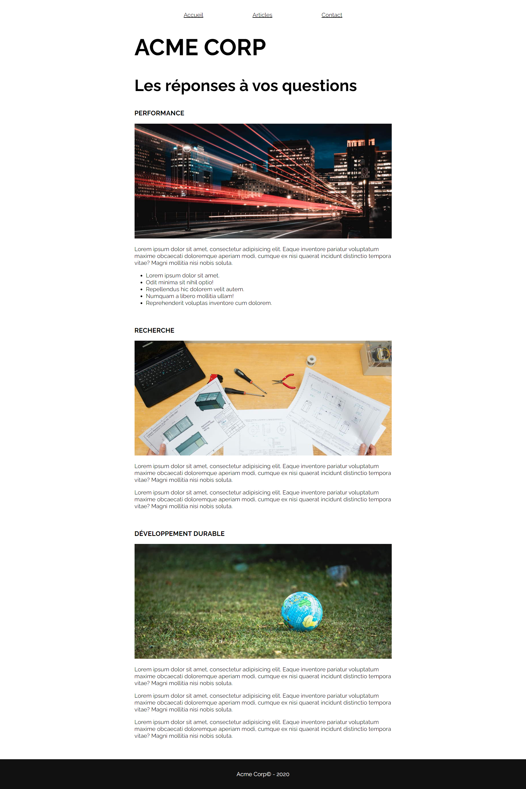

# My Digital School - B3 - HTML/CSS

Vous allez réaliser la maquette HTML/CSS de l'entreprise **Acme Corp**.

## Fonts

Vous utiliserez la police **Raleway** de Google, poids 400 et 700.

> Si vous le souhaitez, vous pouvez utiliser une autre police, de votre choix, pour le titre principal. Ce n'est pas obligatoire

La taille de police de base sera de **20px**.

## Titres

Les titres de premier et troisième niveau seront affichés en majuscules.

Vous êtes libres sur le choix des tailles de police pour les titres.

## Contenu

La largeur du contenu devra être tenue dans un maximum de 900px.

> Note : le menu ne devra pas dépasser la largeur du contenu

## Sections de page

Dans l'aperçu ci-dessous, vous remarquerez qu'on a 3 sections dans la page : Performance, Recherche, et Développement durable.

La structure de ces 3 sections sera la même : un titre, une image, un texte. Au moins un des 3 textes devra faire apparaître une liste (numérotée ou non, peu importe).

Par ailleurs, chaque section devra être suffisamment espacée de la suivante avec l'application d'une marge appropriée.

## Images

Vous êtes libres sur le choix des images.

Taille recommandée : 900px de largeur, 400px de hauteur.

## Footer

Le footer prendra toute la largeur de l'écran. Le fond sera sombre et la police claire.

## Articles et Contact

Ces pages sont à créer avec **le minimum de contenu** : un titre principal présentant l'objet de la page.

Nous reprendrons ensuite cet exercice pour aborder le thème des tableaux et des formulaires, en réalisant ces pages.

> Les éléments du menu "Articles" et "Contact" doivent donc bien pointer vers ces documents HTML

## Aperçu

Vous devrez vous rapprocher au maximum de cet aperçu :

